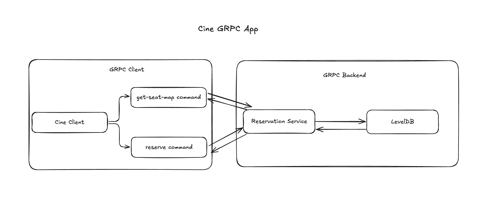
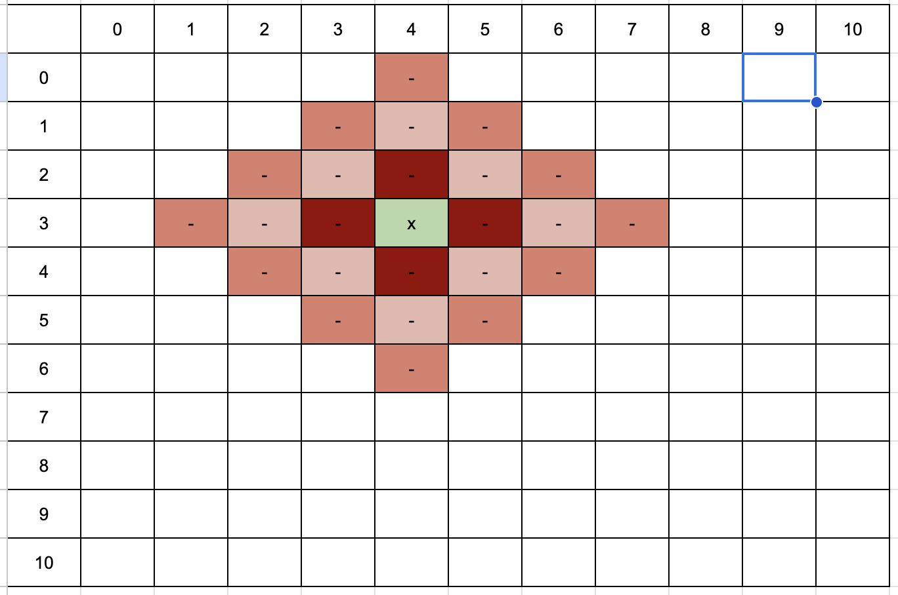

# Cine Reservation App

## Architecture
This application use gPRC to communicate between client and server. The client CLI provides 2 commands `get-seat-map` and `reserver` to retrieve and do reserve.

LevelDB is used to take advantage of key-value and file-based database with no-cost setup



## Reservation Logic
- With selected seat `(x,y)` and `d=3`, finding all points that have distance to `(x,y)` <= d. All these point will make a diamond shape as below (X is the selected seat)

```golang
	for dx := -d; dx <= d; dx++ {
		rem := d - IntAbs(dx)
		for dy := -rem; dy <= rem; dy++ {
			tx := x + dx
			ty := y + dy
			if PositivePair(tx, ty) {
				tp := tx*int(cols) + ty
				result = append(result, int32(tp))
			}

		}
	}
```
- Mark all these points as blocked
## Setup
```bash
make all
```
## Server
```bash
./cine server
```

Flags:
⋅⋅⋅-c, --cols int       number of columns (default 10)
⋅⋅⋅-d, --distance int   distance to server (default 1)
⋅⋅⋅-h, --help           help for server
⋅⋅⋅-r, --rows int       number of rows (default 10)
⋅⋅⋅-p, --port int   server port (default 8080)

## Client
### Get seat map
```bash
./cine client get-seat-map
```
Result:
```bash
|       | COLUMN 0 | COLUMN 1 | COLUMN 2 | COLUMN 3 |
|-------|----------|----------|----------|----------|
| ROW 0 |    -     |    -     |    -     |    -     |
|-------|----------|----------|----------|----------|
| ROW 1 |    -     |    -     |    -     |    -     |
|-------|----------|----------|----------|----------|
| ROW 2 |    -     |    -     |    -     |    -     |
|-------|----------|----------|----------|----------|
| ROW 3 |    -     |    -     |    -     |    -     |
|-------|----------|----------|----------|----------|
R: Reserved; B: Blocked; -: Available
```
### Reserve a seat
```bash
./cine client reserve <x1> <y1> <x2> <y2>
```
Example:
```bash
./cine client reserve 0 0 0 1
```
```
2025-05-09T23:51:14.390+0700    INFO    cine-client     client/main.go:26       Connecting to Cine at port 8080
2025-05-09T23:51:14.393+0700    INFO    cine-client     client/main.go:106      Successfully reserved   {"seats": [[0,0],[0,1]]}
```
Seat map:
```bash
2025-05-09T23:51:18.470+0700    INFO    cine-client     client/main.go:26       Connecting to Cine at port 8080
|       | COLUMN 0 | COLUMN 1 | COLUMN 2 | COLUMN 3 |
|-------|----------|----------|----------|----------|
| ROW 0 |    R     |    R     |    B     |    -     |
|-------|----------|----------|----------|----------|
| ROW 1 |    B     |    B     |    -     |    -     |
|-------|----------|----------|----------|----------|
| ROW 2 |    -     |    -     |    -     |    -     |
|-------|----------|----------|----------|----------|
| ROW 3 |    -     |    -     |    -     |    -     |
|-------|----------|----------|----------|----------|
R: Reserved; B: Blocked; -: Available
```

## Reset data
- Start server & reset db by adding `-s` flag
```bash
go run main.go server -r 4 -c 4 -s
```
